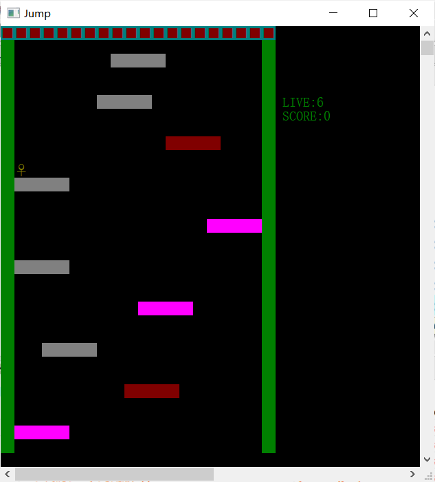

# Introduce

This is my C language curriculum design

# Exhibition

# How to play the game

- LIVE:It is your health

- SCORE:You have get how many score

- You can press W,A,S,D key to move little people.You will lose one point live if you fall to the red floor or hit the top.If you fall to the bottom the game will be over